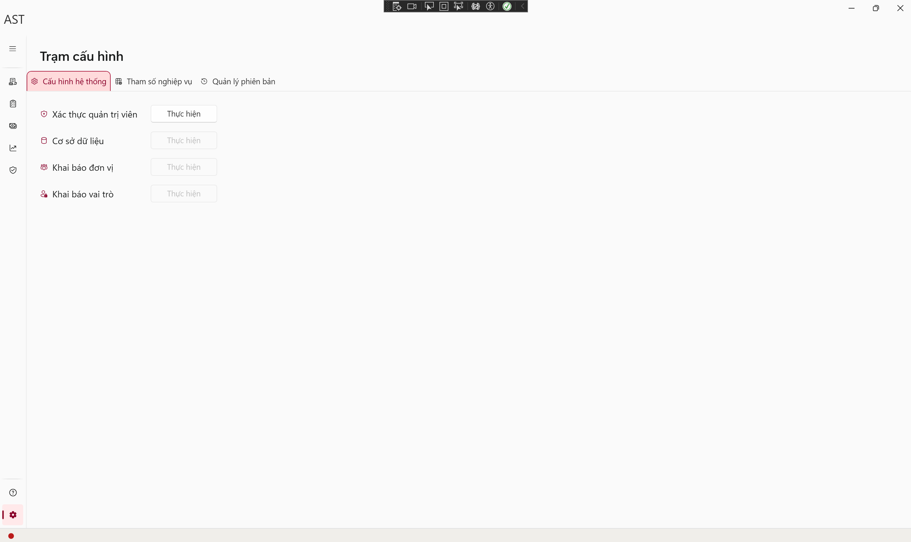
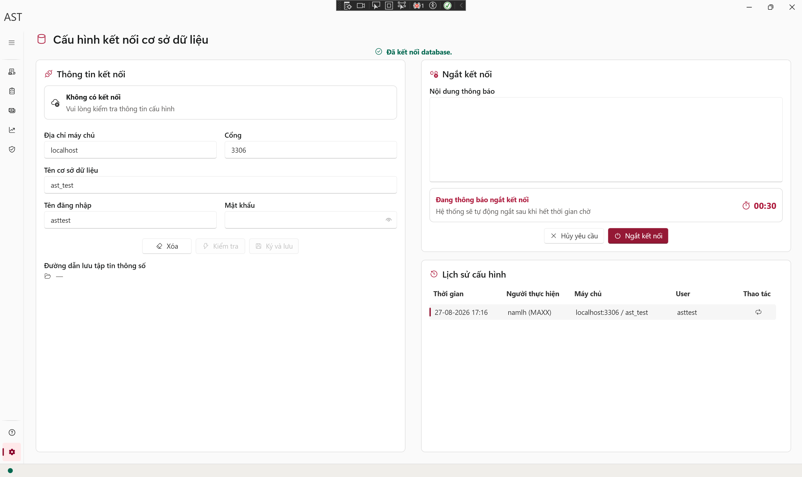
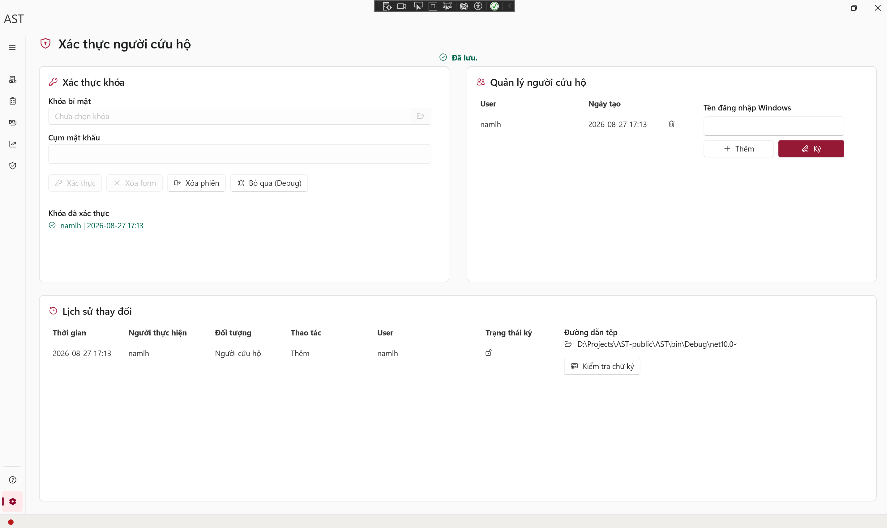
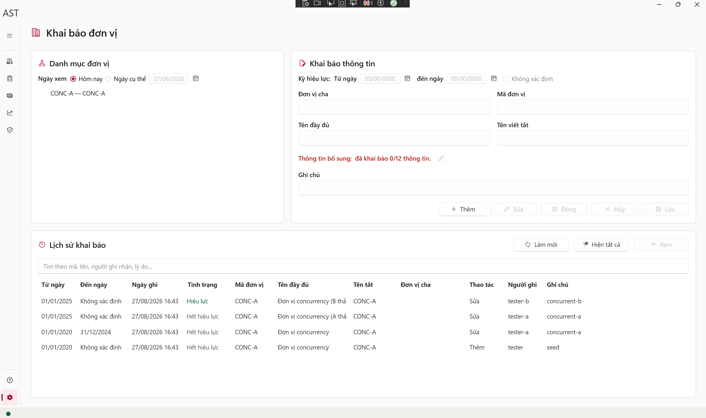
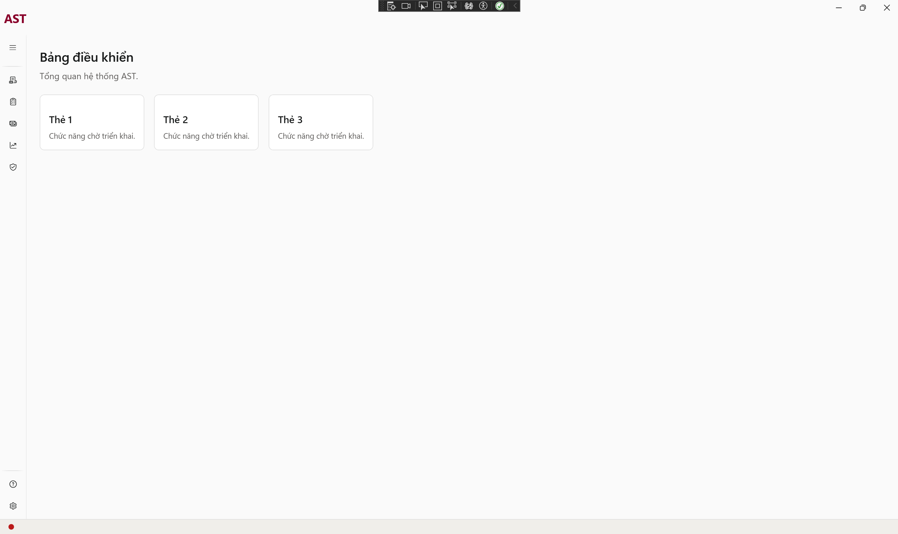
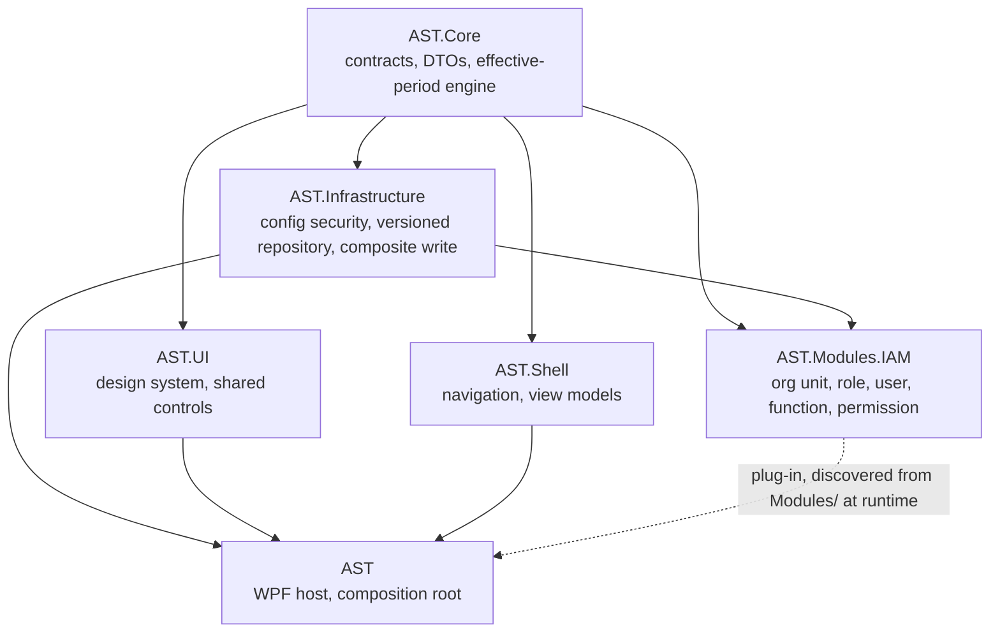

# AST

A WPF line-of-business foundation for banking back-office work, built around a fully-modelled
**temporal data layer**: every parameter carries the period it is effective for, nothing valid is
ever deleted, and a reference may not point outside the period its target is effective for.

On top of that foundation sits a working **IAM module** — organisational units, roles, users,
functions and permissions — with authorisation scoped by org unit and by role.

**Stack:** C# 14 / .NET 10 · WPF + WPF-UI (Fluent) · Prism · MySQL 9.7 via Dapper + MySqlConnector ·
xUnit v3 with integration tests on a real database.

---

## Why this project exists

I am not a software developer. I work in banking operations, where a large share of the day is
still manual: work is moved by hand, checked by hand, and re-entered by hand. Processes and the
tools meant to support them have never been fully pinned down, and the data lives scattered across
separate places rather than in one system. That combination makes losing work — a record, a
correction, a day of entries — a routine risk rather than an exceptional one.

AI coding agents changed what someone in my position can build. So I built this, for myself, for my
colleagues across the organisation I work in, and for people doing the same job elsewhere in our
industry. It is not a commercial product and it is not for sale.

That background explains the parts of AST that look unusually careful for a small project. Nothing
valid is ever deleted, only superseded. Every parameter carries the period it is effective for, and
a reference may not point outside that period. The application never migrates its own database.
Those rules exist because the problem I set out to solve is **losing data**, not storing it.

---

## A note on language

**The user interface, most code comments, and the migration scripts are in Vietnamese.** The
application is built for Vietnamese users, and the comments predate the point where the project
settled on English.

The **design documentation under `docs/` and all identifiers are in English**, so the model is
readable without Vietnamese. If you are here for the temporal-data design rather than the
application itself, `docs/design-effective-period.md` is the place to start.

---

## Status — v0.1.0-alpha

AST runs daily in an internal test environment. What works today is the foundation and the identity
layer: declaring the database connection, admin authentication, the configuration station with its
signed config files and audit chain, a startup sequence that verifies the database schema version
and blocks on a mismatch, and the screens for declaring organisational units and roles. Underneath
those sits the part most of the work went into — an effective-period engine with the full
eight-case algebra for editing a period, strict temporal foreign keys, soft delete, and a composite
write path with named locks.

**What is not built yet.** The sidebar shows five accounting groups — transaction accounting,
internal accounting, treasury and cash-vault, management reporting, inspection and supervision.
Those are navigation scaffolding: every leaf opens a placeholder today, and the dashboard is a
stub. They are the roadmap, in that order. Ahead of them come two pieces that are designed but not
built: the operation-history model and version lifecycle status.

**Cadence.** I use this application in my own work, so faults surface in real use rather than in
testing. I review and fix on a weekly cycle.

**Who builds it.** One person. I am not a developer — I direct AI coding agents and review what
they produce. There is no team behind this and no company. That is worth knowing before you depend
on it.

---

## Screenshots
Shots from the internal test environment (test data only). The UI is in Vietnamese.
| Screen | |
|---|---|
| Configuration station — ordered admin setup |  |
| Database connection — signed connection record |  |
| Break-glass operators — authentication, signing, and audit history |  |
| Org-unit declaration — effective periods and version history |  |
| Dashboard — placeholders for modules not built yet |  |

---

## Progress
AST ships in thin public slices. After the first alpha, work alternates between
**tightening what already runs** and **opening the next product layer** — not a
sprint calendar.
### Shipped
- **2026-08-24 — `v0.1.0-alpha`.** First public cut: effective-period engine,
  soft delete, config security, the IAM module, and the WPF shell.
- **2026-08-25.** Version lifecycle persisted and enforced in the database.
- **2026-08-26 … 27 — maintenance on screens already in use.** Stopped the upsert
  planner from reporting a date gap it was about to fill; replaced unclear English
  operator errors on the org-unit and role declaration screens with settled
  Vietnamese wording (including the gap path: *Kỳ hiệu lực không liên tục.*).
### In progress (maintenance and finish work)
- Weekly review of faults that surface in daily test use of the shipped screens.
- Remaining verification on org-unit history labelling (public issue #3, half still
  open): the English gap message is addressed; the `org_code` replacement /
  “replaced” history scenario is not yet reproduced.
### Next
- Finish operator-facing clarity and history/lifecycle presentation on screens
  that already exist.
- Then the designed-but-unbuilt pieces named under Status: the operation-history
  model, and only after that the five accounting groups in the sidebar (today
  every leaf is still a placeholder, as in the dashboard screenshot).

---

## Architecture



| Project | Owns |
|---|---|
| `AST.Core` | Contracts, DTOs, the effective-period engine and its algebra, presentation resolvers. No infrastructure, no WPF. |
| `AST.Infrastructure` | Config security (signed files, audit chain), the versioned repository base, the composite-write unit of work, logging. |
| `AST.Modules.IAM` | The IAM data and service layer. Loaded as a Prism plug-in from `Modules/` at runtime, not linked into the host. |
| `AST.UI` | Design-system tokens and shared controls (`AstDateBox`, `AstEffectivePeriod`, `AstDialog`, …). |
| `AST.Shell` | Sidebar navigation and the declaration view models. |
| `AST` | The WPF host, the composition root, and the views. |

Eight test projects sit alongside them, including `AST.Meta.Tests` — guards that fail the build
when a boundary rule is broken, rather than leaving it to a reviewer to notice.

---

## The temporal model

This is the part worth reading even if you never run the application. Full detail:
`docs/design-effective-period.md`; which entities get a period and why:
`docs/design-temporality-classes.md`.

- **Header + version.** An entity is an identity row (`org_unit`) plus a stream of version rows
  (`org_unit_version`), each carrying `effective_from` / `effective_to`. Resolving an entity means
  resolving it *at a date*.
- **Soft delete, never hard.** An edit inserts a new version and deactivates the old. A delete
  deactivates. Data that was once valid stays readable.
- **The eight-case algebra.** Editing a period can trim, split, overwrite or extend the versions
  around it. All eight cases are enumerated, implemented in one place, and tested against a real
  database.
- **Strict temporal foreign keys.** A child's period must be covered by its parent's, end to end.
  Declaring a child beyond its parent's period is **blocked**, not silently accepted — the design
  prefers a clear failure over silent ambiguity.
- **One operation, one date.** A business operation captures "today" once, at the caller, and
  threads it through. Guards never re-read the clock.

---

## Running it

**Prerequisites:** .NET 10 SDK · Docker (or your own MySQL 9.7) · the `mysql` client, unless you
use the Docker-only variant of step 2 below.

```bash
# 1. Start MySQL (creates ast_db and ast_test)
docker compose up -d

# 2. Apply the migrations. This is NOT optional -- see below.
./scripts/apply-migrations.sh          # Windows: .\scripts\apply-migrations.ps1

# 3. Point the tests at the database
cp mysql.secrets.sample.json mysql.secrets.json

# 4. Run
dotnet run --project AST
```

No `mysql` client installed? Step 2 works through the container instead — everything else is
unchanged:

```bash
for f in migrations/V*.sql; do
  docker exec -i ast-mysql mysql -uast -past-dev-only ast_db < "$f"
done
```

**The application never migrates its own database.** It verifies the schema version at startup and
blocks with a readable message if it does not match. Skip step 2 and you will see that block. This
is deliberate: in the environment AST is built for, schema changes are applied by hand, reviewed,
version by version — the application is never trusted to alter a database on its own.

## Running the tests

```bash
dotnet test
```

Integration tests run against **real MySQL by design** — no database mocks and no Testcontainers. A
mocked database cannot tell you whether a recursive CTE resolves a subtree correctly or whether a
named lock actually serialises two writers, and those are the things most likely to be wrong.

They **drop every table on each run**, so point them at `ast_test` (the default in
`mysql.secrets.sample.json`), never at a database holding data you care about. Without a reachable
database the integration tests skip rather than fail.

The build runs with `TreatWarningsAsErrors`, so a warning is already a build failure.

---

## Licence

MIT — see [LICENSE](LICENSE).
