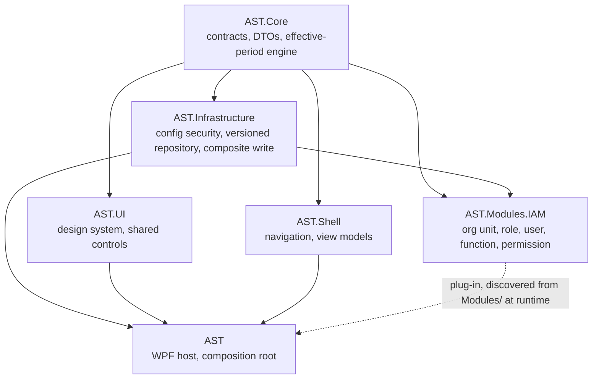

# AST

A WPF line-of-business foundation for banking back-office work, built around a fully-modelled
**temporal data layer**: every parameter carries the period it is effective for, nothing valid is
ever deleted, and a reference may not point outside the period its target is effective for.

On top of that foundation sits a working **IAM module** — organisational units, roles, users,
functions and permissions — with authorisation scoped by org unit and by role.

**Stack:** C# 14 / .NET 10 · WPF + WPF-UI (Fluent) · Prism · MySQL 9.7 via Dapper + MySqlConnector ·
xUnit v3 with integration tests on a real database.

---

## Why this project exists

I am not a software developer. I work in banking operations, where a large share of the day is
still manual: work is moved by hand, checked by hand, and re-entered by hand. Processes and the
tools meant to support them have never been fully pinned down, and the data lives scattered across
separate places rather than in one system. That combination makes losing work — a record, a
correction, a day of entries — a routine risk rather than an exceptional one.

AI coding agents changed what someone in my position can build. So I built this, for myself, for my
colleagues across the organisation I work in, and for people doing the same job elsewhere in our
industry. I personally fund its development. It is not a commercial product and it is not for sale.

That background explains the parts of AST that look unusually careful for a small project. Nothing
valid is ever deleted, only superseded. Every parameter carries the period it is effective for, and
a reference may not point outside that period. The application never migrates its own database.
Those rules exist because the problem I set out to solve is **losing data**, not storing it.

---

## A note on language

**The user interface, most code comments, and the migration scripts are in Vietnamese.** The
application is built for Vietnamese users, and the comments predate the point where the project
settled on English.

The **design documentation under `docs/` and all identifiers are in English**, so the model is
readable without Vietnamese. If you are here for the temporal-data design rather than the
application itself, `docs/design-effective-period.md` is the place to start.

---

## Status — active development; latest release v0.1.0-alpha

AST is being built and tested in an internal environment to validate banking-operations
requirements. **It is not in production use.** Operational deployment across business units is a
longer-term goal. The description below covers the current source on `main`; the
[alpha release notes](https://github.com/namlh-mx/AST/releases/tag/v0.1.0-alpha) describe that
specific, earlier build.

What works today is the foundation and the identity
layer: declaring the database connection, admin authentication, the configuration station with its
signed config files and audit chain, a startup sequence that verifies the database schema version
and blocks on a mismatch, and the screens for declaring organisational units and roles. Underneath
those sits the part most of the work went into — an effective-period engine with the full
eight-case algebra for editing a period, strict temporal foreign keys, soft delete, and a composite
write path with named locks. Version lifecycle status is persisted and enforced in the database;
it is no longer a planned-only feature.

**What is not built yet.** The sidebar shows five accounting groups — transaction accounting,
internal accounting, treasury and cash-vault, management reporting, inspection and supervision.
Those are navigation scaffolding: every leaf opens a placeholder today, and the dashboard is a
stub. They are the roadmap, in that order. Ahead of them comes the designed-but-unbuilt
operation-history model. See the [maintenance record and roadmap](docs/maintenance-and-roadmap.md).

**Cadence.** I review feedback from internal testing and fix faults on a weekly cycle.

**Who builds it.** One person. I am not a developer — I direct AI coding agents and review what
they produce. There is no team behind this and no company. That is worth knowing before you depend
on it.

### Internal testing and community reach

Workplace information-security requirements constrain work-support applications to the internal
network, without a direct connection to the public Internet. AST's current evaluation follows
that model. The people testing it are banking operations staff who use the application directly,
without GitHub accounts or a software-development workflow.

Stars, forks and GitHub release downloads therefore give only a limited picture of this testing
activity. Wider outreach to the banking community has not started. The public record includes
[issue #7](https://github.com/namlh-mx/AST/issues/7), filed by the maintainer on behalf of two office
testers, and the fixes described there. This is evidence of internal feedback, not a claim of
broad deployment or measured productivity gains.

The source and design documents are public so that other practitioners and developers can
evaluate and reuse the foundation. Public development material uses code and synthetic examples;
customer data and confidential workplace information do not belong in GitHub reports. See the
[evaluation guide](docs/evaluation-guide.md) for a synthetic example and a feedback checklist.

---

## Screenshots
Shots from the internal test environment (test data only). The UI is in Vietnamese.
| Screen | |
|---|---|
| Configuration station — ordered admin setup |  |
| Database connection — signed connection record |  |
| Break-glass operators — authentication, signing, and audit history |  |
| Org-unit declaration — effective periods and version history |  |
| Dashboard — placeholders for modules not built yet |  |

---

## Progress
AST ships in thin public slices. After the first alpha, work alternates between
**tightening what already runs** and **opening the next product layer** — not a
sprint calendar.
### Shipped
- **2026-08-24 — `v0.1.0-alpha`.** First public cut: effective-period engine,
  soft delete, config security, the IAM module, and the WPF shell.
- **2026-08-25.** Version lifecycle persisted and enforced in the database.
- **2026-08-26 … 27 — maintenance on screens already in use.** Stopped the upsert
  planner from reporting a date gap it was about to fill; replaced unclear English
  operator errors on the org-unit and role declaration screens with settled
  Vietnamese wording (including the gap path: *Kỳ hiệu lực không liên tục.*).
- **2026-08-28 — maintenance on screens already in use.** Extended settled
  Vietnamese operator wording to the org-unit and role declaration error maps,
  break-glass and config-audit screens, and platform chrome (dashboard
  placeholders, configuration station, connection declaration). Closed the
  platform error-code catalogues for config, startup, and break-glass — each
  now has a named, completeness-tested code set so a new code cannot ship
  without being registered.
- **2026-08-29 — maintenance on screens already in use.** Platform error codes
  that reach an operator now show settled Vietnamese sentences through a single
  shared describer — eight platform sites no longer forward raw error text, and
  ten catalogued codes each have a dedicated operator sentence.
- **2026-09-07.** [Issue #3](https://github.com/namlh-mx/AST/issues/3) closed after the
  org-unit replacement/history work; [issue #4](https://github.com/namlh-mx/AST/issues/4)
  closed after fixes to Save-button state and date-field interactions.
- **2026-09-09.** [Issue #7](https://github.com/namlh-mx/AST/issues/7) closed after fixes
  to parent-unit display and an Add action racing with a pending card load.
### In progress (maintenance and finish work)
- Weekly review of faults that surface in daily test use of the shipped screens.
### Next
- Finish operator-facing clarity and history/lifecycle presentation on screens
  that already exist.
- Then the designed-but-unbuilt pieces named under Status: the operation-history
  model, and only after that the five accounting groups in the sidebar (today
  every leaf is still a placeholder, as in the dashboard screenshot).

---

## Architecture



| Project | Owns |
|---|---|
| `AST.Core` | Contracts, DTOs, the effective-period engine and its algebra, presentation resolvers. No infrastructure, no WPF. |
| `AST.Infrastructure` | Config security (signed files, audit chain), the versioned repository base, the composite-write unit of work, logging. |
| `AST.Modules.IAM` | The IAM data and service layer. Loaded as a Prism plug-in from `Modules/` at runtime, not linked into the host. |
| `AST.UI` | Design-system tokens and shared controls (`AstDateBox`, `AstEffectivePeriod`, `AstDialog`, …). |
| `AST.Shell` | Sidebar navigation and the declaration view models. |
| `AST` | The WPF host, the composition root, and the views. |

Seven test projects sit alongside them, including `AST.Meta.Tests` — tests that detect broken
boundary rules rather than leaving them to a reviewer to notice.

---

## The temporal model

This is the part worth reading even if you never run the application. Full detail:
`docs/design-effective-period.md`; which entities get a period and why:
`docs/design-temporality-classes.md`.

- **Header + version.** An entity is an identity row (`org_unit`) plus a stream of version rows
  (`org_unit_version`), each carrying `effective_from` / `effective_to`. Resolving an entity means
  resolving it *at a date*.
- **Soft delete, never hard.** An edit inserts a new version and deactivates the old. A delete
  deactivates. Data that was once valid stays readable.
- **The eight-case algebra.** Editing a period can trim, split, overwrite or extend the versions
  around it. All eight cases are enumerated, implemented in one place, and tested against a real
  database.
- **Strict temporal foreign keys.** A child's period must be covered by its parent's, end to end.
  Declaring a child beyond its parent's period is **blocked**, not silently accepted — the design
  prefers a clear failure over silent ambiguity.
- **One operation, one date.** A business operation captures "today" once, at the caller, and
  threads it through. Guards never re-read the clock.

---

## Running it

**Prerequisites:** Windows for the WPF application · .NET 10 SDK · Docker (or your own MySQL 9.7) ·
the `mysql` client, unless you use the Docker-only variant of step 2 below.

These are developer setup steps for a disposable environment. Banking staff evaluating an
internally prepared build can start with the [evaluation guide](docs/evaluation-guide.md).

```bash
# 1. Start MySQL (creates ast_db and ast_test)
docker compose up -d

# 2. Apply the migrations. This is NOT optional -- see below.
./scripts/apply-migrations.sh          # Windows: .\scripts\apply-migrations.ps1

# 3. Point the tests at the database
cp mysql.secrets.sample.json mysql.secrets.json

# 4. Run
dotnet run --project AST
```

No `mysql` client installed? Step 2 works through the container instead — everything else is
unchanged:

```bash
for f in migrations/V*.sql; do
  docker exec -i ast-mysql mysql -uast -past-dev-only ast_db < "$f"
done
```

**The application never migrates its own database.** It verifies the schema version at startup and
blocks with a readable message if it does not match. Skip step 2 and you will see that block. This
is deliberate: in the environment AST is built for, schema changes are applied by hand, reviewed,
version by version — the application is never trusted to alter a database on its own.

## Running the tests

```bash
dotnet test
```

Integration tests run against **real MySQL by design** — no database mocks and no Testcontainers. A
mocked database cannot tell you whether a recursive CTE resolves a subtree correctly or whether a
named lock actually serialises two writers, and those are the things most likely to be wrong.

They **drop every table on each run**, so point them at `ast_test` (the default in
`mysql.secrets.sample.json`), never at a database holding data you care about. With no test
database connection configured, the IAM integration tests skip. If a connection is configured but the
database is unreachable, they fail instead of skipping.

The build runs with `TreatWarningsAsErrors`, so a warning is already a build failure.

The alpha release records results for that build. CodeQL checks cover static analysis; they do
not establish that the full test suite passed. See [verification evidence and reporting](docs/maintenance-and-roadmap.md#verification-evidence)
for the distinction and for recording a new run without treating skipped tests as coverage.

## Contributing and reporting problems

Banking practitioners can contribute reproducible feedback, synthetic examples and clearer
wording; coding experience is not required. Reports in Vietnamese or English are welcome.
See [CONTRIBUTING.md](CONTRIBUTING.md) for feedback and pull-request guidance. Suspected
vulnerabilities should go through the private channel in [SECURITY.md](SECURITY.md).

---

## Licence

MIT — see [LICENSE](LICENSE).
